Payment Billing Management System

Objective:-
The main objective of Payment Billing System is to manage details of bills, customer, product and logins. The project is totally built at administrative end and thus only admin is guaranteed the access. The purpose of the project is to built an application program to reduce the manual work.	

Functional  Requirements:
Admin:
	Add, update and delete details of any buyer or product.
	Can see the list of all the buyers and product.
	Can search all the buyers by contact no. and update and delete their data.
	Can search all the products by product ID and update and delete it’s data.

Software Specificatios:
Operating System   	 : 	Windows 10/x-64
Languages  		 : 	java 
Front End	   	 : 	Swing
Platform		 : 	NetBeans IDE 8.2
Backend                             : 	MySQL

Classes of Payment Billing System:-
	Buyer Class: Manages all the operations of the buyer.
1.	New Buyer
2.	Update Buyer
3.	Buyer Details
4.	Delete Buyer
	Product Class: Manages all the operations of product.
1.	New Product
2.	Update Product
3.	Product Details
4.	Delete Product
	Bill Class: Manages all the operations of bill.

Classes and their attributes:-
	Buyer attributes: name,contactNo,email,address,gender.
	Product attributes: pID, pName, rate, description, activate
                                  (here,activate states the availability of the product)

Class Diagram:

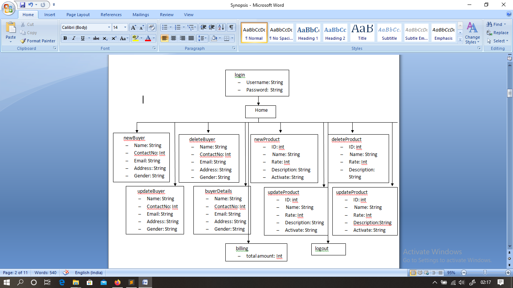

	

	

ER Diagram:-
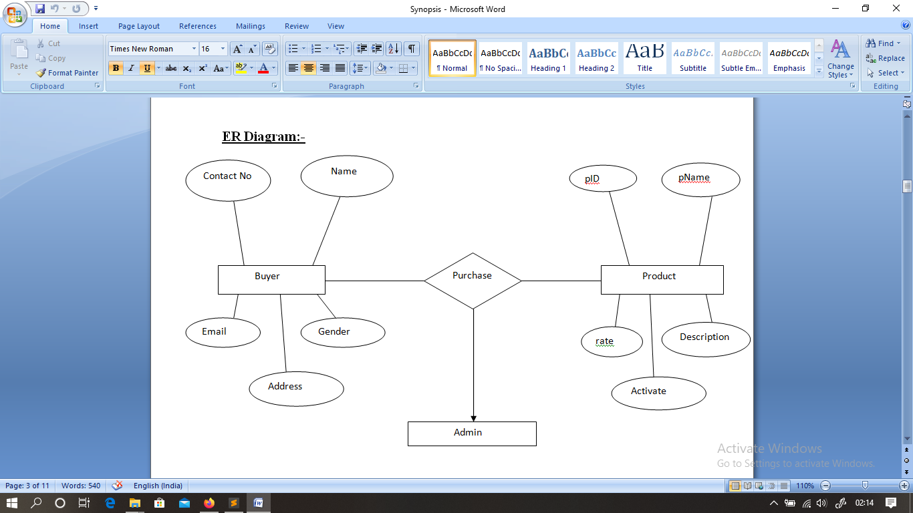

Dataflow Diagram:-

Activity Diagram:-

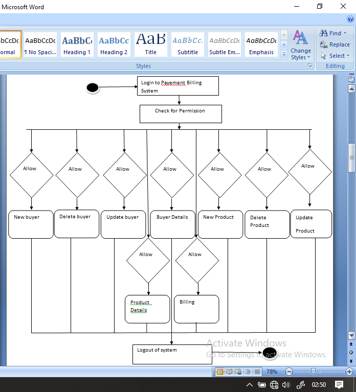

Steps:-
1.Login as admin.
On filling incorrect details:
 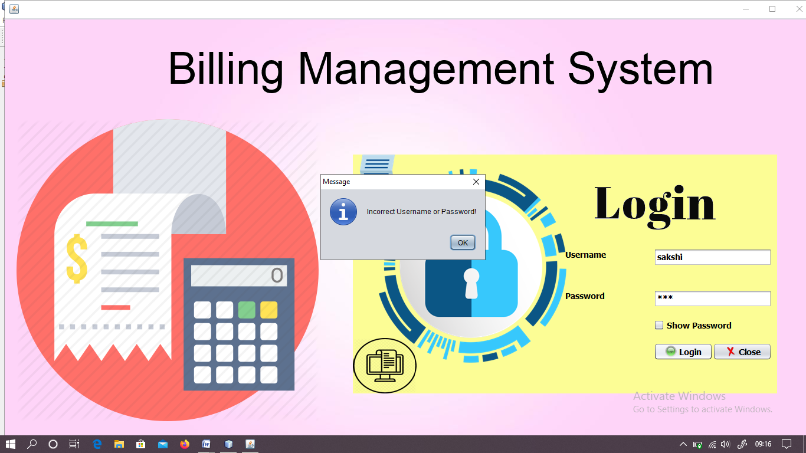

On filling cocrrect details:
 

2. Now admin can enter details of new buyer,update details of buyer,see the list of buyers and delete information of any buyer.
•	To insert a  details of any new buyer:
 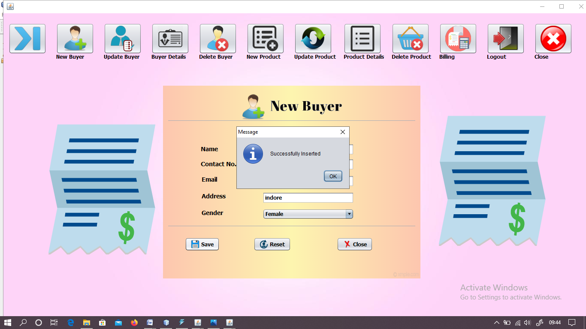
•	To update details of any buyer:
 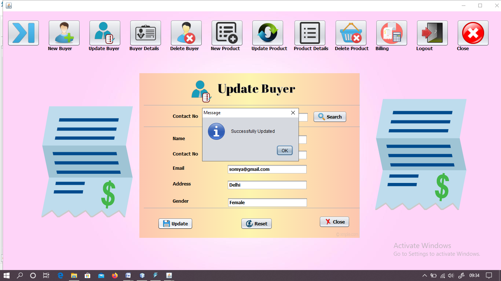
•	To see the  details of all the buyers:
 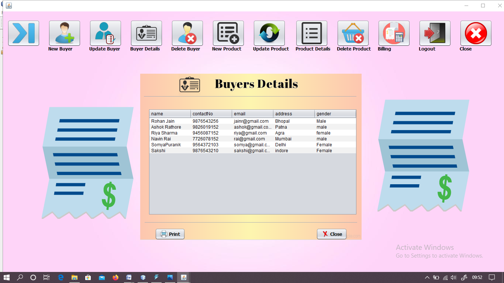
•	To delete the details  of any buyer:
 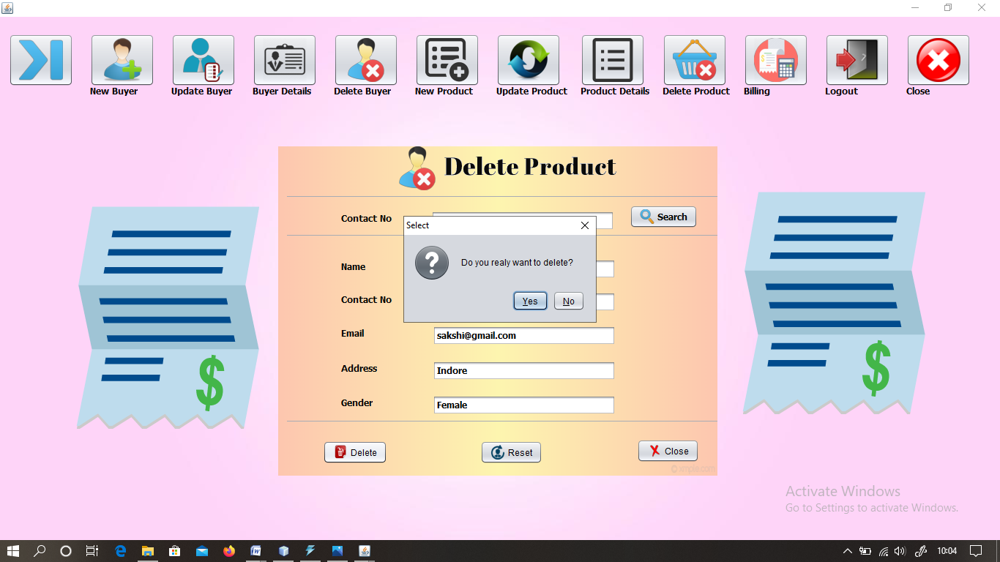

3. Similarly, admin has the authority for insert, update, delete and see the details of any product.
•	To insert new product:
 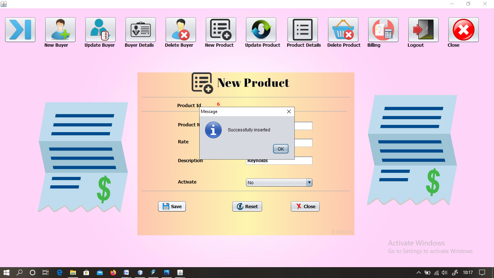
•	To update any product details:
 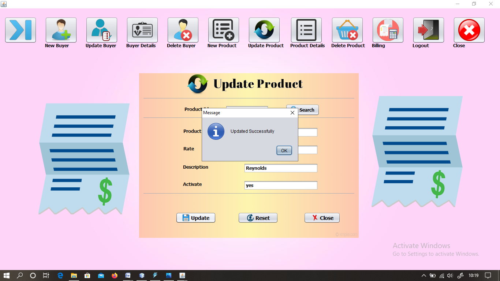
•	To look product details:
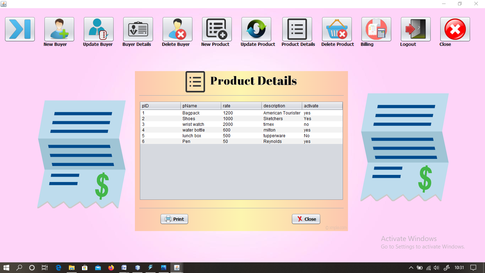 
•	To delete any product details:
  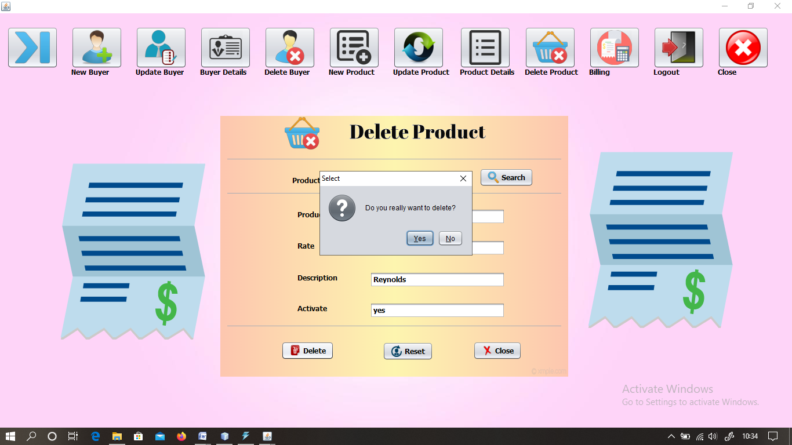

4.To generate bill:
 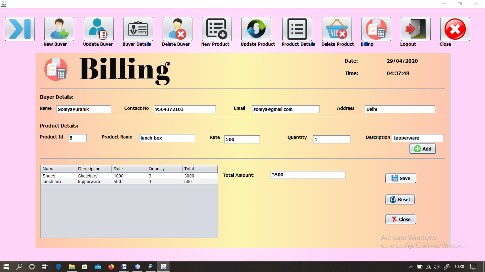 

5.Logout
  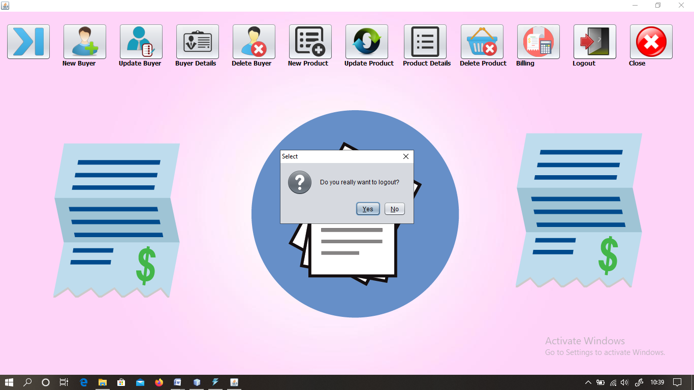

                                                                                                                                 Submitted By:-
                                                                                                                                 Sakshi Modi
